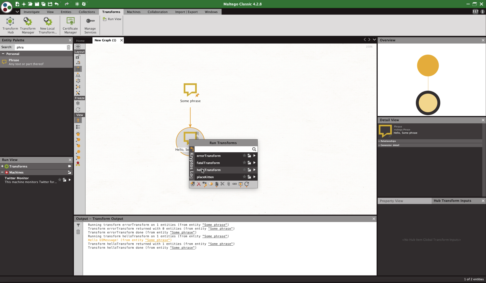

# tedious [](https://pages.github.com/kryptoslogic/tedious/_build/html/)

tedious allows developers, analysts and hackers to quickly write Maltego transforms and expose those transforms to other users without needing to package anything up or manage dependencies. We make everything as simple as we can for the author of the transform so that they don't need to do anything apart from write transform code.

[](https://www.youtube.com/watch?v=EcA4tv3hCaU)

## Supported:
- Transforms on Maltego Entities & Third Party Entities if you generate classes for them (see Updating Entities)

## TODO:
- Custom Entities
- [Links/Labels/Properties](https://docs.maltego.com/support/solutions/articles/15000024277-trx-transform-library-guide#link-properties-bookmarks-and-notes)

## Example Setup
```sh
pip install -r requirements.txt
cd examples
./self_sign.sh # generates SSL certificates
python3 server.py
```

In the Maltego Transform Hub click the giant + and fill in the details. Seed URL should look something like: `https://127.0.0.1:31337/seed`

### Debug:

`tedious` subclasses Flask, so we get some cool debugging features for free,
including live-reload on code changes.

```sh
FLASK_DEBUG=1 python3 server.py
```

## Updating Entities
- Go to Maltego
- Open Entities tab
- Click Manage Entities
- <kbd>CTRL</kbd>+<kbd>A</kbd>
- Export
- `python3 scripts/entity_class_gen.py --mtz PathToMaltego.mtz`
